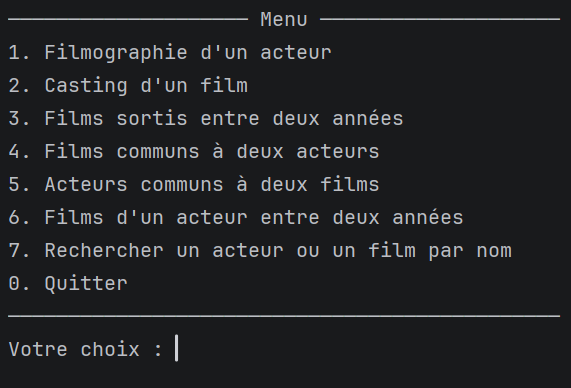
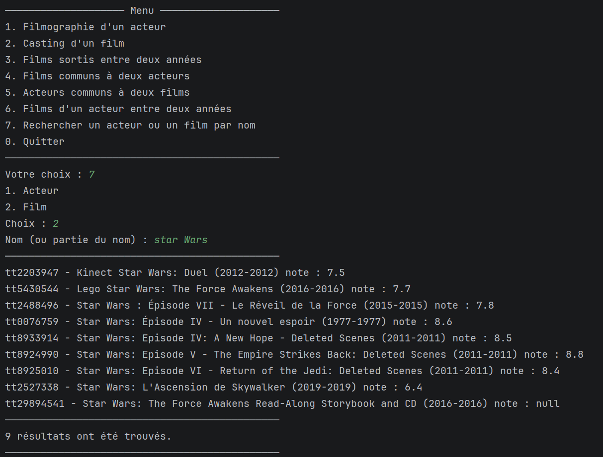

# Films IMDb — Import JPA/Hibernate + Console de recherche


[](LICENSE)

Projet école (Diginamic) : import d'un dataset IMDb (`films.json`, ~21.7 Mo, 2748 films) dans une base
MariaDB via JPA/Hibernate, puis exploration des données via une application console (7 opérations de
recherche).

## Aperçu

| Menu principal | Recherche par nom |
|---|---|
|  |  |

## Stack technique

- **Java 21** (Maven, `maven.compiler.source`/`target` = 21)
- **Hibernate ORM 7.4.4** (implémentation JPA)
- **MariaDB** (pilote `mariadb-java-client` 3.5.9)
- **Jackson** (`jackson-databind`) pour le parsing du JSON source
- **Lombok** pour réduire le boilerplate (getters/setters/constructeurs)
- **dotenv-java** pour charger les identifiants de connexion depuis un `.env` non versionné
- **JUnit 5** pour les tests unitaires sur `FilmMapper` (voir plus bas — hors périmètre du projet école, approfondissement personnel)

## Structure du projet

```
conception/                          document de conception initial (diagrammes, DDL)
sql/
  schema.sql                         DDL complet (base + 9 tables)
  reset_db.sql                       vide les données sans toucher au schéma
src/main/resources/
  films.json                         dataset source
  META-INF/persistence.xml           configuration JPA
src/main/java/fr/diginamic/cinema/
  entity/                            7 entités JPA
  persistence/                       EntityManagerProvider
  dao/                                couche DAO générique + 7 DAOs concrets
  json/                               DTOs miroir de films.json
  mapper/                             FilmMapper + DedupCaches (DTO -> entités)
  service/                            ImportService, RechercheService
  console/                            Saisie, Affichage, MenuActions
  app/                                 ImportApp, MenuApp (points d'entrée)
src/test/java/fr/diginamic/cinema/
  mapper/                              FilmMapperTest (tests unitaires, hors périmètre)
```

## Prérequis

- JDK 21
- Maven
- Une base MariaDB accessible sur `localhost:3306`, au choix :
  - **Docker** (recommandé) — voir la section suivante.
  - **Installation manuelle** (ex. via XAMPP).
- Un fichier `.env` à la racine (copier `.env.example` puis renseigner `DB_USER`/`DB_PASSWORD`) —
  voir "Mise en place de la base de données" ci-dessous.

## Mise en place de la base de données

### Option A — Docker (recommandé)

Un `docker-compose.yml` à la racine lance une MariaDB déjà configurée, avec le schéma
(`sql/schema.sql`) appliqué automatiquement au premier démarrage :

```powershell
docker compose up -d
```

Pour repartir d'une base vide :

```powershell
docker compose down -v
docker compose up -d
```

### Option B — Installation manuelle (ex. XAMPP)

Le schéma est écrit à la main (`hibernate.hbm2ddl.auto=validate` dans `persistence.xml`, Hibernate ne
génère rien) : il faut donc l'exécuter manuellement avant tout import.

Créer la base et les tables :

```powershell
Get-Content sql\schema.sql | & "C:\xampp\mysql\bin\mysql.exe" -u root
```

Pour vider les données entre deux imports de test, sans recréer le schéma :

```powershell
Get-Content sql\reset_db.sql | & "C:\xampp\mysql\bin\mysql.exe" -u root cinema
```

Pour un reset complet (schéma + données) :

```powershell
& "C:\xampp\mysql\bin\mysql.exe" -u root -e "DROP DATABASE IF EXISTS cinema;"
Get-Content sql\schema.sql | & "C:\xampp\mysql\bin\mysql.exe" -u root
```

Dans les deux cas, base `cinema` sur `localhost:3306`. Les identifiants (utilisateur `root`, pas de mot
de passe) ne sont plus en dur dans `persistence.xml` : copier `.env.example` en `.env` à la racine du
projet et y renseigner `DB_USER`/`DB_PASSWORD` (`.env` n'est pas versionné, `.env.example` sert de
modèle). `EntityManagerProvider` les lit au démarrage et les injecte par-dessus `persistence.xml`.

## Lancer l'import

Exécuter `fr.diginamic.cinema.app.ImportApp` (point d'entrée). Lit `films.json`, dédoublonne les
entités répétées, puis persiste tout en base (par lot, une transaction par collection plutôt qu'une
par entité). Environ 95 s sur une base vide pour les 2748 films.

**L'import est idempotent.** Le relancer sur une base déjà peuplée précharge l'existant (id IMDb pour
`Personne`/`Film`, nom/libellé normalisé pour les entités de référence) et ne persiste que ce qui est
réellement nouveau — aucune contrainte unique violée, aucune donnée dupliquée. Un ré-import complet ne
prend alors qu'une dizaine de secondes.

## Lancer l'application de recherche

Exécuter `fr.diginamic.cinema.app.MenuApp` (point d'entrée). Menu console, options **1 à 7** pour les
recherches, **0** pour quitter :

1. Filmographie d'un acteur
2. Casting d'un film
3. Films sortis entre deux années
4. Films communs à deux acteurs
5. Acteurs communs à deux films
6. Films d'un acteur entre deux années
7. Rechercher un acteur ou un film par nom

Les options 1 à 6 attendent des ids IMDb bruts (ex. `nm0000001` pour une personne, `tt0082449` pour un
film) — l'option 7 permet de les retrouver à partir d'un nom (ou fragment de nom) si on ne les connaît
pas déjà.

## Lancer les tests

```powershell
mvn test
```

38 tests unitaires JUnit 5 sur `FilmMapper` (parsing des dates/notes/tailles/années, dédoublonnage,
fusion des doublons, gardes sur les clés optionnelles absentes). ⚠️ Cette suite de tests n'est pas une
exigence du projet école — c'est un approfondissement personnel ajouté après coup.

## Documentation complémentaire

- **`conception/document_conception.md`** — document de conception initial (diagrammes de classes/ER,
  script DDL, constats sur les données sources).
- **`CODE_EXPLANATION.md`** — explication détaillée de tout le code, package par package, dans l'ordre
  du flux de données réel.
- **`PLAN.md`** — suivi complet du projet séance par séance : décisions prises, bugs réels trouvés et
  corrigés, raisonnement derrière chaque choix.

## Licence

Le code de ce projet est sous licence MIT (voir `LICENSE`).

`films.json` est un jeu de données scrapé depuis IMDb, inclus dans ce dépôt pour la reproductibilité
du projet (import, tests). Il n'est **pas** couvert par la licence MIT ci-dessus et reste la propriété
de ses ayants droit — fourni ici à des fins pédagogiques uniquement, sans revendication de propriété ni
autorisation de réutilisation commerciale.
