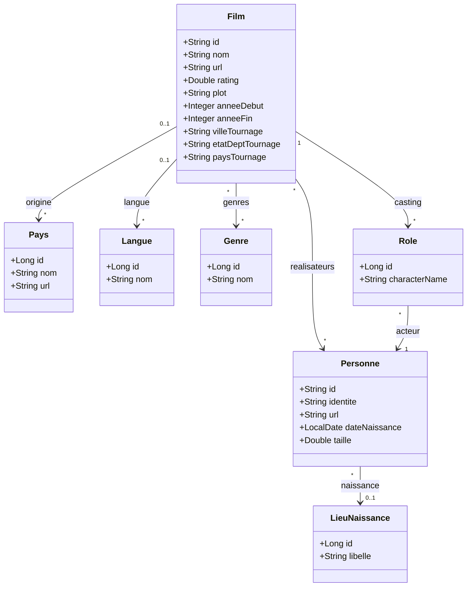
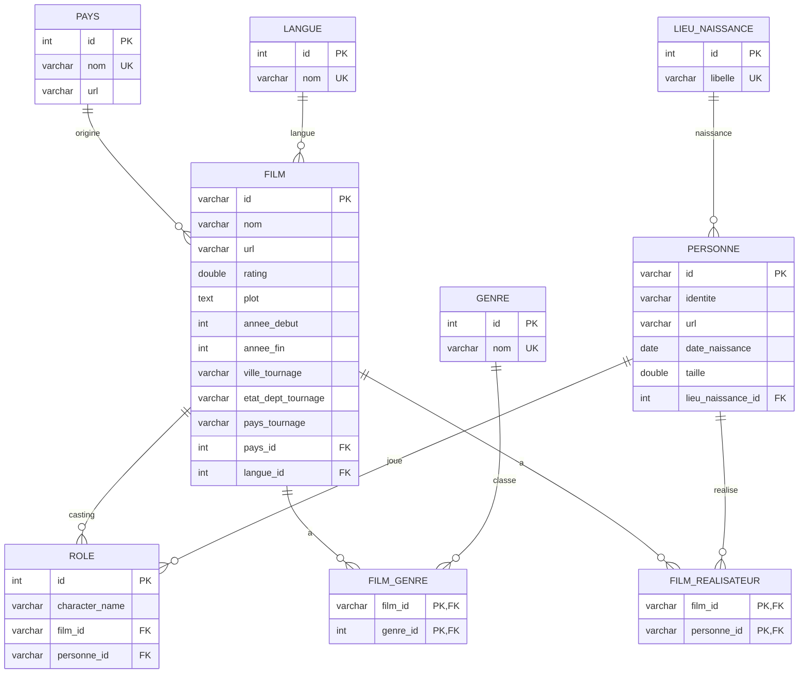

# Document de conception - Projet Internet Movie DataBase

Source de données retenue : `films.json` (JSON global, parsing avec Jackson).

## 1. Analyse des données sources

Le fichier `films.json` contient 2748 films. Analyse de la structure :

- **Entités metier identifiées dans le sujet** : lieu de naissance, pays, langue, genre.
- **Anomalies detectées dans les données** (à traiter au parsing, tache n°3) :
  - 38 `id` de films dupliqués (ex. `tt0182576`) -> déduplication à prevoir avant insertion, puisque `id` devient cle primaire.
  - 547 `rating` au format français (virgule au lieu du point decimal, ex. `"6,1"`).
  - 102 `anneeSortie` sous forme de plage (ex. `"1969-1970"`) au lieu d'une année unique -> modelisé en `anneeDebut`/`anneeFin`.
  - Champs optionnels : `langue` absent sur 19 entrées, `rating` sur 46, `pays` sur 18, `lieuTournage` sur 589.
  - Éspaces parasites en fin de chaine sur `dateNaissance` et `lieuNaissance` -> `trim()` au parsing.
- **Acteurs et realisateurs** : même structure de données (`id`, `identite`, `url`, `naissance`), et une même personne peut apparaitre dans les deux rôles selon les films. Modelisées comme une seule entité `Personne`.
- **`castingPrincipal`** : duplique les mêmes personnes déjà présentes dans `roles` (sans le nom du personnage) -> ignore au parsing, non repris dans le modèle.
- **`lieuTournage`** : structure ville/etatDept/pays propre à chaque film, sans contrainte d'unicité demandée et sans reutilisation entre films -> modelisé en attributs embarques dans `Film`, pas en entité à part.

## 2. Diagramme de classes



### Justifications

- **`Personne` unifiée** (acteurs + réalisateurs) : évite la duplication et les conflits d'identité quand une même personne cumule les deux roles. `taille` (height) reste `null` pour quelqu'un qui n'a jamais été acteur.
- **`Role` en classe association** : la relation `Film`-`Personne` pour le casting porte une donnée (`characterName`), d'où une classe intermediaire plutôt qu'une simple association many-to-many.
- **Relation directe `Film`-`Personne` pour les réalisateurs** : pas d'attribut à porter, donc many-to-many simple, sans passer par `Role`.
- **Cardinalites optionnelles** (`Pays`, `Langue`, `LieuNaissance` en 0..1) : cohérentes avec les champs manquants relevés en section 1.
- **`anneeDebut`/`anneeFin`** plutôt qu'un `anneeSortie` unique : gère les series sans casser le typage `Integer`.

## 3. Modèle entité-association



## Choix de conception

### Clés primaires

- `FILM.id` et `PERSONNE.id` : clés naturelles (identifiants IMDb, ex. `tt0082449`, `nm0000001`) en `VARCHAR(15)`, pas de génération automatique. Les 38 doublons détectes dans le JSON sont à dédupliquer au parsing (tâche n°3) puisque l'id devient PK.
- `PAYS`, `LANGUE`, `GENRE`, `LIEU_NAISSANCE`, `ROLE` : clés techniques `INT AUTO_INCREMENT`, l'id n'existe pas dans la source.

### Contraintes d'unicité (UK)

Conformément au sujet : `PAYS.nom`, `LANGUE.nom`, `GENRE.nom`, `LIEU_NAISSANCE.libelle` sont uniques.

### Relations many-to-many

Deux tables de jonction, sans attribut propre, clé primaire composite :

- `FILM_GENRE` (film_id, genre_id).
- `FILM_REALISATEUR` (film_id, personne_id).
  `ROLE` n'est pas une simple table de jonction : elle porte `character_name`, donc elle à sa propre clé technique (`id INT AUTO_INCREMENT`) et se modèlise comme une entité à part entière plutôt qu'une table film_x_personne composite.

### Nullabilité (FK optionnelles)

- `FILM.pays_id` et `FILM.langue_id` : nullable (0..1 cote FILM), 18 et 19 entrées du JSON n'ont pas cette info.
- `PERSONNE.lieu_naissance_id` : nullable, certaines personnes n'ont pas de lieu de naissance renseigne.
- `FILM.ville_tournage` / `etat_dept_tournage` / `pays_tournage` : tous nullable en bloc (attributs embarqués), absents sur 589/2748 films.

### Types

- `date_naissance` en `date` (LocalDate cote JPA) conformément à l'exigence du sujet.
- `rating` en `double`, la conversion virgule/point se fait au parsing JSON -> Java, pas au niveau du schéma.
- Toutes les colonnes texte "libres" (nom, url, lieuTournage) sont en `VARCHAR(255)` par défaut, sauf celles dont la taille réelle a été verifiée dans le JSON source (`identite VARCHAR(150)`, `character_name VARCHAR(150)`).

## 4. Modèle physique de données

SGBD cible : MariaDB (XAMPP), moteur InnoDB, charset utf8mb4.

```sql
-- Création de la base de données.
-- On vérifie qu'elle n'existe pas.
CREATE DATABASE IF NOT EXISTS cinema
    COLLATE utf8mb4_general_ci;

-- On se déplace sur la base pour la suite du script.
USE cinema;

-- Force la connexion client/serveur à encoder les échanges en UTF-8 (4 octets)
-- pour la session en cours
SET NAMES utf8mb4;

-- Désactive temporairement la vérification des clés étrangères.
-- Utile si les tables ne sont pas créés dans le bon ordre.
SET FOREIGN_KEY_CHECKS = 0;

-- Création de la table pays, les pays doivent être uniques.
CREATE TABLE pays (
    id          INT AUTO_INCREMENT PRIMARY KEY,
    nom         VARCHAR(100) NOT NULL,
    url         VARCHAR(255),

    CONSTRAINT uk_pays_nom UNIQUE (nom)
);

-- Création de la table langue, les langues doivent être uniques.
CREATE TABLE langue (
    id          INT AUTO_INCREMENT PRIMARY KEY,
    nom         VARCHAR(50) NOT NULL,

    CONSTRAINT uk_langue_nom UNIQUE (nom)
);

-- Création de la table genre, les genres doivent être uniques.
CREATE TABLE genre (
    id          INT AUTO_INCREMENT PRIMARY KEY,
    nom         VARCHAR(50) NOT NULL,

    CONSTRAINT uk_genre_nom UNIQUE (nom)
);

-- Création de la table lieu_naissance, les lieux de naissance doivent être uniques.
CREATE TABLE lieu_naissance (
    id          INT AUTO_INCREMENT PRIMARY KEY,
    libelle     VARCHAR(255) NOT NULL,

    CONSTRAINT uk_lieu_naissance_libelle UNIQUE (libelle)
);

-- Création de la table personne.
CREATE TABLE personne (
    id                  VARCHAR(15) PRIMARY KEY,   -- identifiant IMDb, ex. nm0000001
    identite            VARCHAR(150) NOT NULL,
    url                 VARCHAR(255),
    date_naissance      DATE,
    taille              DOUBLE,
    lieu_naissance_id   INT,

    CONSTRAINT fk_personne_lieu_naissance
        FOREIGN KEY (lieu_naissance_id)
        REFERENCES lieu_naissance(id)
);

-- Création de la table film.
CREATE TABLE film (
    id                      VARCHAR(15) PRIMARY KEY,  -- identifiant IMDb, ex. tt0082449
    nom                     VARCHAR(255) NOT NULL,
    url                     VARCHAR(255),
    rating                  DOUBLE,
    plot                    TEXT,
    annee_debut             INT,
    annee_fin               INT,
    ville_tournage          VARCHAR(255),
    etat_dept_tournage      VARCHAR(255),
    pays_tournage           VARCHAR(255),
    pays_id                 INT,
    langue_id               INT,

    CONSTRAINT fk_film_pays
        FOREIGN KEY (pays_id)
        REFERENCES pays(id),

    CONSTRAINT fk_film_langue
        FOREIGN KEY (langue_id)
        REFERENCES langue(id),

    -- On fait attention que l'année de fin est supérieure ou égale à l'année de début.
    CONSTRAINT chk_film_annees
        CHECK (annee_fin IS NULL OR annee_fin >= annee_debut),

    -- On garde la note du film entre 0 et 10 inclus.
    CONSTRAINT chk_film_rating
        CHECK (rating IS NULL OR (rating >= 0 AND rating <= 10))
);

-- Création de l'index pour éviter de scanner toute la table
-- quand l'année de début est une condition de recherche.
CREATE INDEX idx_film_annee_debut ON film(annee_debut);

-- Création de la table role.
CREATE TABLE role (
    id              INT AUTO_INCREMENT PRIMARY KEY,
    character_name  VARCHAR(150),
    film_id         VARCHAR(15) NOT NULL,
    personne_id     VARCHAR(15) NOT NULL,

    CONSTRAINT fk_role_film
        FOREIGN KEY (film_id)
        REFERENCES film(id),

    CONSTRAINT fk_role_personne
        FOREIGN KEY (personne_id)
        REFERENCES personne(id)
);

-- Création de la table de jointure entre film et genre.
CREATE TABLE film_genre (
    film_id     VARCHAR(15) NOT NULL,
    genre_id    INT NOT NULL,
    PRIMARY KEY (film_id, genre_id),

    CONSTRAINT fk_film_genre_film
        FOREIGN KEY (film_id)
        REFERENCES film(id),

    CONSTRAINT fk_film_genre_genre
        FOREIGN KEY (genre_id)
        REFERENCES genre(id)
);

-- Création de la table de jointure entre film et personne.
CREATE TABLE film_realisateur (
    film_id     VARCHAR(15) NOT NULL,
    personne_id VARCHAR(15) NOT NULL,
    PRIMARY KEY (film_id, personne_id),

    CONSTRAINT fk_film_real_film
        FOREIGN KEY (film_id)
        REFERENCES film(id),

    CONSTRAINT fk_film_real_personne
        FOREIGN KEY (personne_id)
        REFERENCES personne(id)
);

-- Maintenant que la base et les tables sont créées
-- on réactive la vérification des clés étrangères.
SET FOREIGN_KEY_CHECKS = 1;
```
